# Consultas_1_SQL
introduccion a las consultas a una BD usando el lenguaje SQL

## Base de datos: Ventas
## Tabla: Cliente

## Instruccion SELECT
- permite seleccionar datos de una tabla.
- su formato es: 'SELECT CAMPOS_tabla FROM nombre tabla``

## Consulta N°  1

1. Para visualizar toda la información que contiene la tabla Cliente se puede incluir con la introducción SELECT el caracter **\*** o cada uno de los campos de la tabla.

- `SELECT * FROM Cliente`
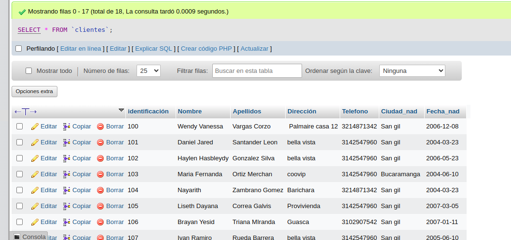

- `SELECT identificacion, nombre, apellidos, direccion, telefono,ciudad_nac, fecha_nac FROM Cliente`
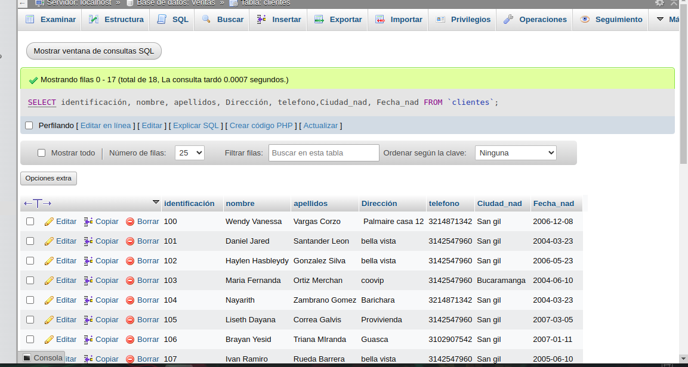

### consulta N° 2

2. Para visualizar solamente la identificacion del Cliente: `SELECT identificacion FROM Cliente`
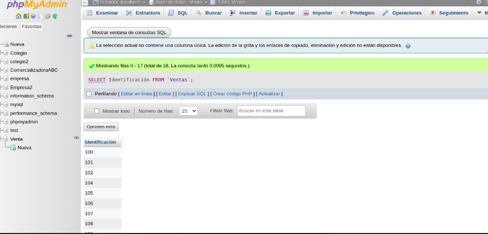

### consulta N°3

3. Si se desea obtener los registros cuya identificacion sea mayor o igual a 150, se debe utilizar la cláusula `WHERE` que especifica las condiciones que deben reunir los registros que se van a seleccionar: `SELECT * FROM Cliente WHERE identificacion>=150`
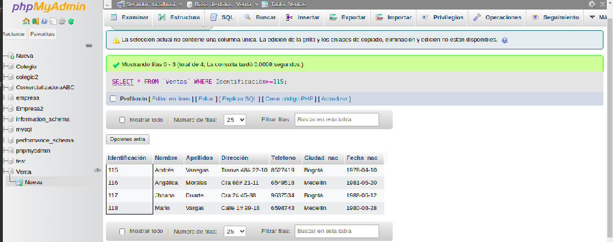

### consulta N°4

4. se desea obtener los registros cuyos apellidos sean Vanegas o Celina, se debe utilizar el operador `IN` Que especifica los registros de una tabla. 

`SELECT apellidos FROM cliente WHERE apellidos IN('vanegas', 'celina')`
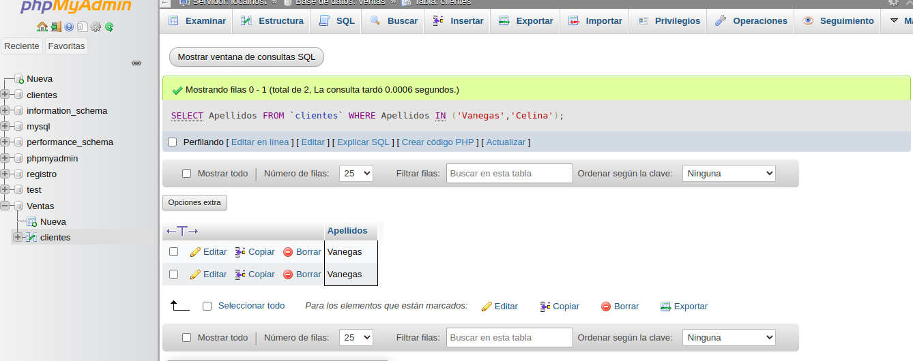

O se puede utilizar el operador `OR`
`SELECT apellidos FROM cliente WHERE apellidos ='vanegas'OR apellidos = 'celina'`
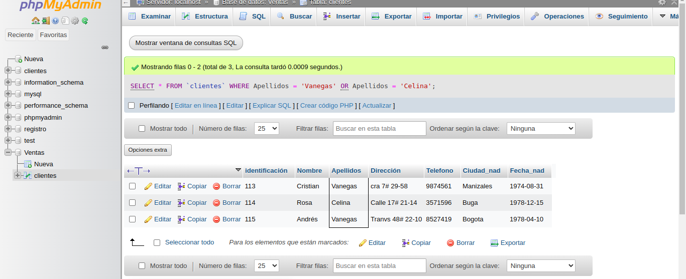

### Consulta No. 5

5. Se desea obtener los registros cuya identificacion sea menor de 110 y la ciudad sea  Cali, se debe utilizar el operador `AND`

`SELECT * FROM Cliente WHERE identificacion<=110 AND ciudad_nac = 'Cali'`

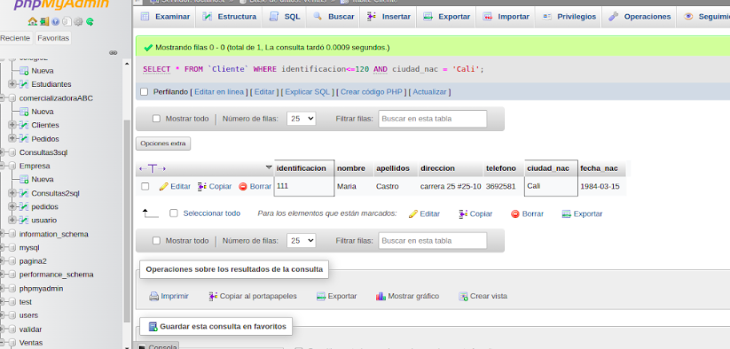

### consulta No. 6

6. Si se desea obtener los registros cuyos nombres empiecen por la letra 'A', se debe utilizar el operador 'LIKE' que utiliza los patrones `%´"(todos) y `_` (caracter).

`SELECT * FROM Cliente WHERE nombre LIKE 'A%'`

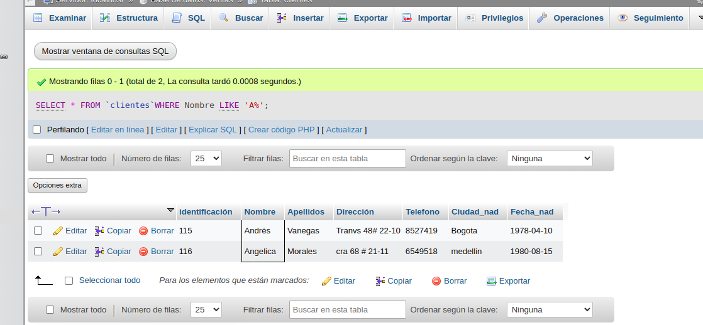

### consulta No. 7

7. se desea obtener los registros cuyos nombres contengan la letra 'a'

`SELECT * FROM Cliente WHERE nombre LIKE '%a%'`

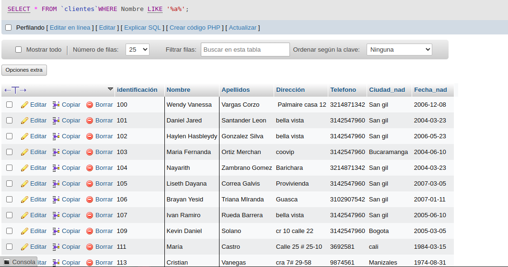

### consulta No. 8

8. se desea obtener registros donde la cuarta letra del nombre del cliente sea la letra 'a'

`SELECT * FROM `Cliente WHERE nombre LIKE '____a''

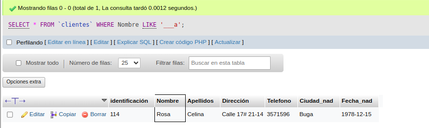

### consulta No. 9

9. si se desea obtener los registros cuya identificzcion esté entre el intervalo 110 y 150. se debe utilizar la cláusula  `BETWEEN`, que sirve para especificar un intervalo de valores.

`SELECT * FROM `clientes` WHERE identificacion BETWEEN 110 AND 150`

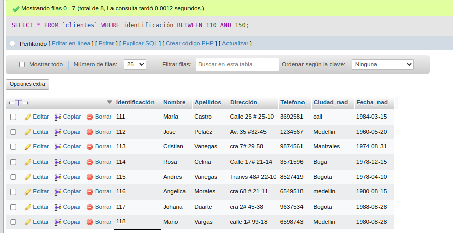

## Instruccion DELETE
- permite borrar todos o un grupo especifico de registros de una tabla
- su formato es: `SELECT campos_tabla FROM nombre_tabla`

### Eliminación No. 1

1. Eliminar los registros cuya identificacion sea mayor a 116

`DELETE FROM `clientes` WHERE identificación > 116`

2. Eliminar los registros cuya identificacion sea igual a 114

`DELETE FROM Cliente WHERE identificacion = 114`

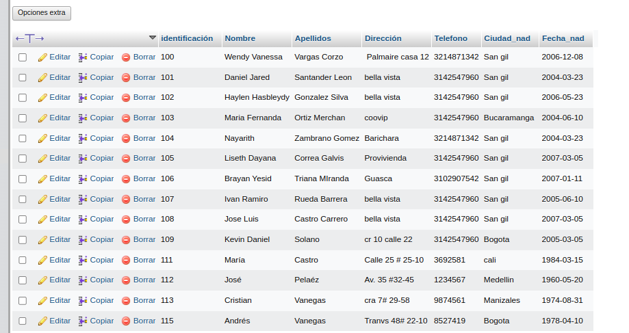

## Instruccion UPDATE
- permite actualizar un campo de una tabla.
- su formato es: `UPDATE nombre_tabla SET nombre_campo = valor`

### Actualización No. 1

1. Para actualizar la ciudad de ncimiento de Cristian Vanegas, cuya identificación es 113

`UPDATE Cliente SET Ciudad_nac = 'Pereira' WHERE identificació=113` 

