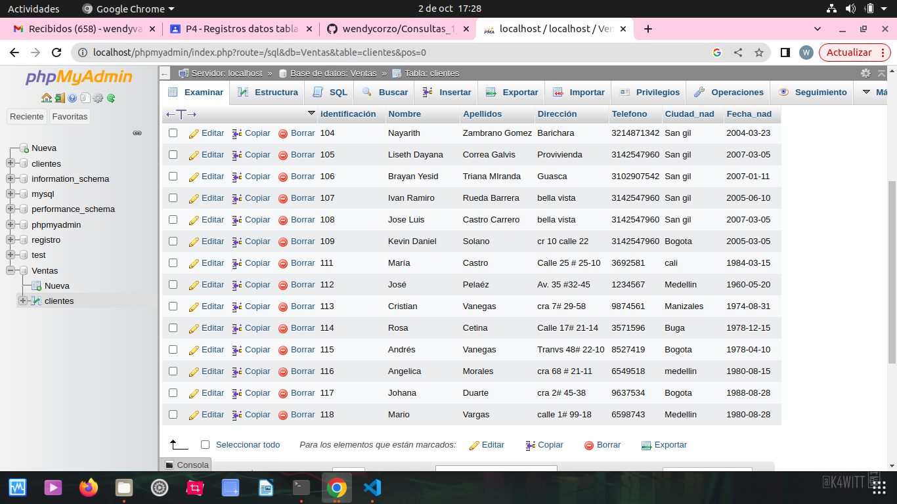
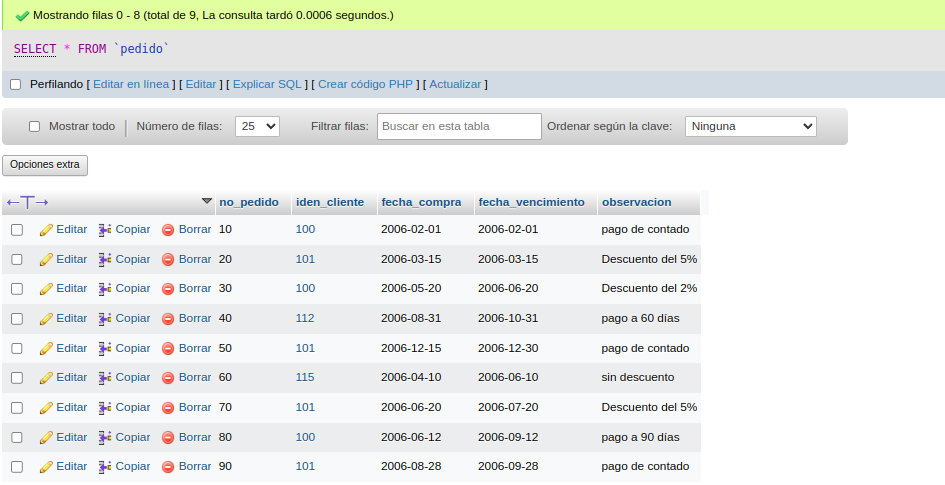
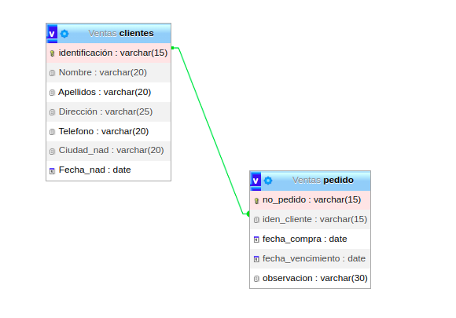
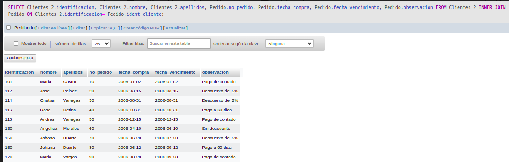
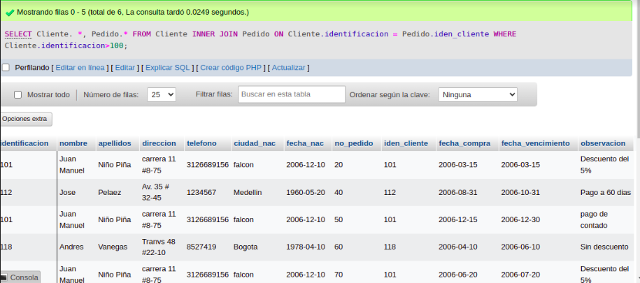

# consultas_1_sql
# Introduccion a las consultas a una BD usando el lenguaje SQL

## Base de datos: Ventas
## Tabla: Cliente

## Instruccion SELECT
- permite seleccionar datos de una tabla
- su formto es: `SELECT campos_tabla FROM nombre tabla``

### consulta No. 1 
1. para visualizar toda la informacion que contiene la tabla cliente se puede incluir con la instruccio SELECT el caracter **\***  caa uno de los campos de la tabla.

- `SELECT * FROM Cliente`

- `SELECT identificacion, nombre, apellidos, 
direccion, telefono, ciudad_nac, fecha_nac FROM Cliente`

### consulta No. 2

2. para visualizar solamente la identificacion del cliente:`SELECT identificacion FROM Cliente`

### consulta No. 3

3. si se desea obtener los registros cuya identificacion sea ayor o igual a 150, se debe utilizar la clausula `WHERE` que especifica las condiciones que deben reunir los registros que se van a seleccionar: `SELECT * FROM Cliente WHERE identificacion>=150`

### consulta No. 4

4. se desea obtener los registros cuyos apellidos sean vanegas o Celina, se debe utilizar el operador `IN` que especifica los registros que se requieren visualizar en una tabla

`SELECT apellidos FROM Cliente WHERE apellidos IN('Vanegas', 'Cetina') `o se puede utilizar el operador `OR`

`SELECT apellidos FROM Cliente WHERE apellidos = 'Vanegas' OR apellidos = 'Cetina' `

### consulta No. 5

5. se desea obtener los registros cuya identificacion sea enor de 110 y la ciudad sea cali, se debe utilizar el operador `AND`

`SELECT * FROM Cliente WHERE identificacion<=115 AND ciudad_nac ='Cali'`

### consulta No. 6

6. si se desea obtener los registros cuyos nombres empiecen por la letra a `A`, se debe utilizar el operador `LIKE`que utiliza patrones `%` (todos) y `_` (caracter).

`SELECT * FROM cliente WHERE nombre LIKE 'A%' ` 

### consulta No. 7

7. se desea obtener los registros cuyos nombres contengan la etra 'a' 

`SELECT * FROM Cliente WHERE nombre LIKE '%a%'`

### consulta No. 8

8. se desea obtener los registros dnde la cuarta letra del nombre del cliente sea la letra 'a'

`SELECT * FROM Cliente WHERE nombre LIKE '   a'`

### consulta No. 9

9. si se desea obtener los registros cuya identificacion este entre el intervalo 110 y 150, se debe utilizar la clausula `BETWEEN`, que sirve para especificar un intervalo de valores.

`SELECT * FROM Cliente WHERE identificación BETWEEN 110 AND 150`

## Instruccion DELETE
- permite borrar todos o un grupo especifico de registro de una tabla.
- su formto es: `DELETE FROM nombre tabla`

### Eliminacion No. 1

1. eliminar los registros cuya identificacion sea mayor a 170.(no habian mayores de 170)

`DELETE FROM Cliente WHERE identificacion > 170`

 
 ### Actualización No. 1

1. para actualizar la ciudad de nacimiento de cristian vanegas, cuya identificación es 114.

`UPDATE usuario SET ciudad_nac = 'pereira' WHERE identificación=114`

## creacion tabla pedido
### diccionario de datos 
|campo|tipo de dato|Longitud|
|-----|------------|--------|
|***no_pedido**|varchar|15|
|iden_cliente|varchar|15|
|fecha_compra|date||
|fecha_vencimiento|date||
|observacion|varchar|30|

### tabla:pedido

### modelo entidad - Relacion

## OPERADOR INNER JOIN
-Permite obtener datos de dos o mas tablas.
-cuando se realiza la concatenacion de las tablas, no necesariamente se deben mostrar todos los datos de las tablas.
-su formato es:
`SELECT tabla1.campo, tabla2.campo, ... FROM tabla_principal INNER JOIN tabla_secundaria ON campo_comun_tabla1 = campo_comun_tabla2`

1.Para visualizar los campos identificacion,nombre,apellidos de la tabla cliente y no_pedido, fecha_compra, fecha_vencimiento y observacion de la tabla pedido, se debe realizar la siguiente instruccion:

`SELECT Cliente.identificacion, Cliente.nombre, Cliente.apellido, Pedido.no_pedido, Pedido.fecha_compra, Pedido.fecha_vencimiento, Pedido.observacion FROM Cliente INNER JOIN Pedido ON Cliente.identificacion = Pedido.iden_cliente`

2. Para visualizar todos los campos de las tablas Cliente y Pedido donde identificacion sea mayor que 100, se debe realizar la siguiente instruccion:

`SELECT Cliente.*, Pedido.* FROM Cliente INNER JOIN Pedido ON Cliente.identificacion = Pedido.iden_cliente WHERE Cliente.identificacion>100`

